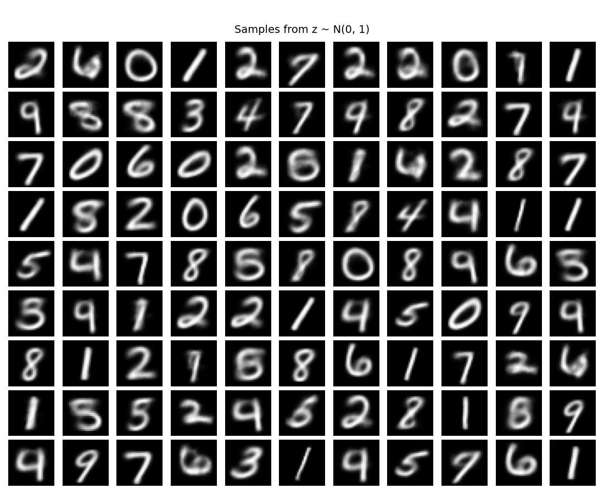
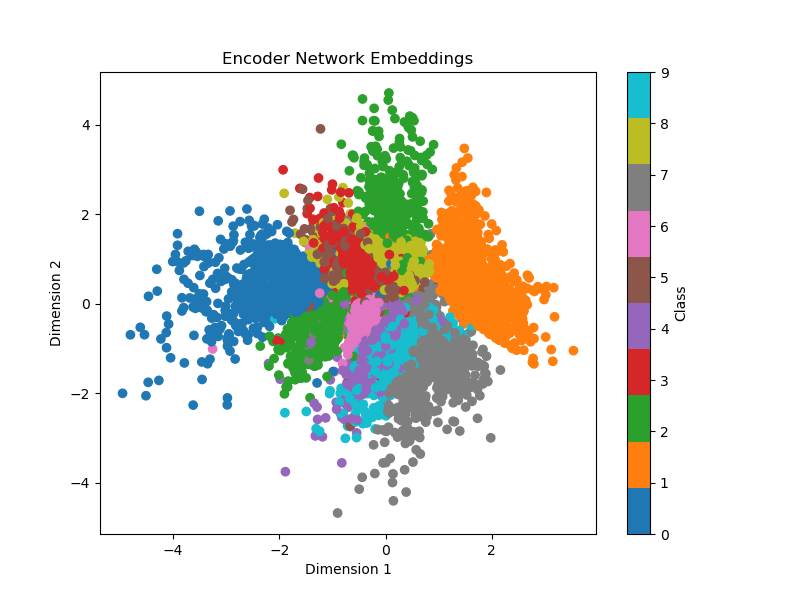
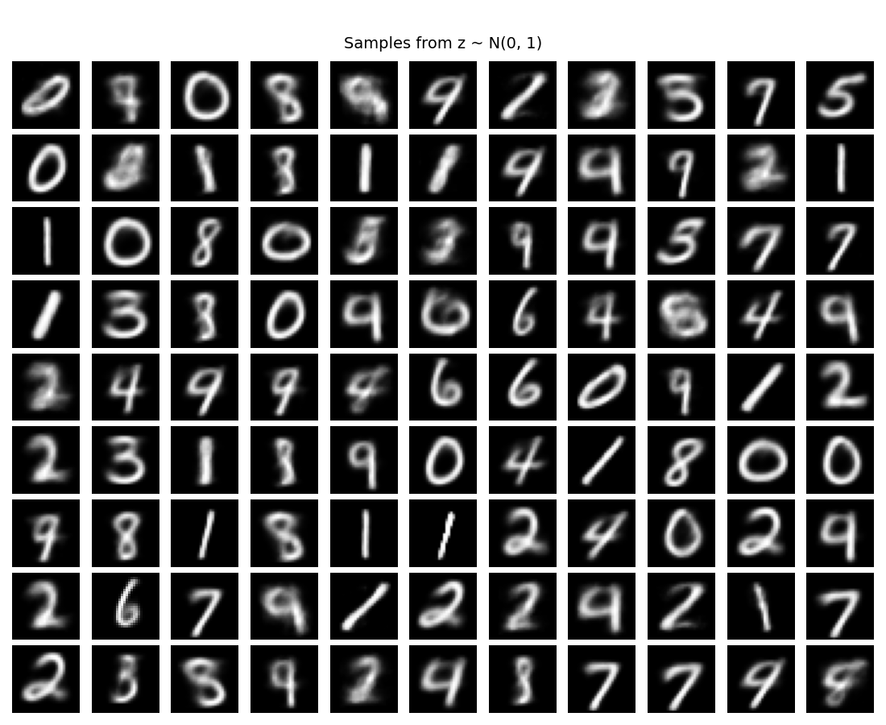
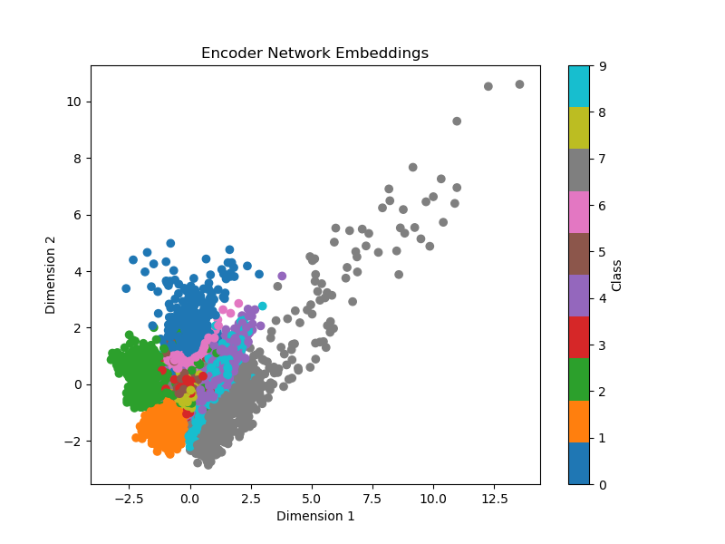

# Variational-Autoencoders

Simple implementation of two variational autoencoders using the dependencies below. Using a standard VAE and a MMD-VAE, this code can 1) build a generative distribution over MNIST / FashionMNIST images, 2) sample, and 3) visualize the embeddings.

# Dependencies

The following dependencies are required:
```
matplotlib==3.6.3
numpy==1.26.2
torch==2.0.1
torchvision==0.15.2
typer==0.9.0
```
Other versions of the above packages may work but have not been tested.

# Examples with the classical VAE

To train and visualize the classical VAE, you can use:
```
python main.py --verbose --plot --mode vae
```

Samples from learned generative model:



Embeddings from learned generative model:



# Examples with the MMD-VAE

To train and visualize the MMD-VAE, you can use:
```
python main.py --verbose --plot --mode mmd
```

Samples from learned generative model:



Embeddings from learned generative model:


